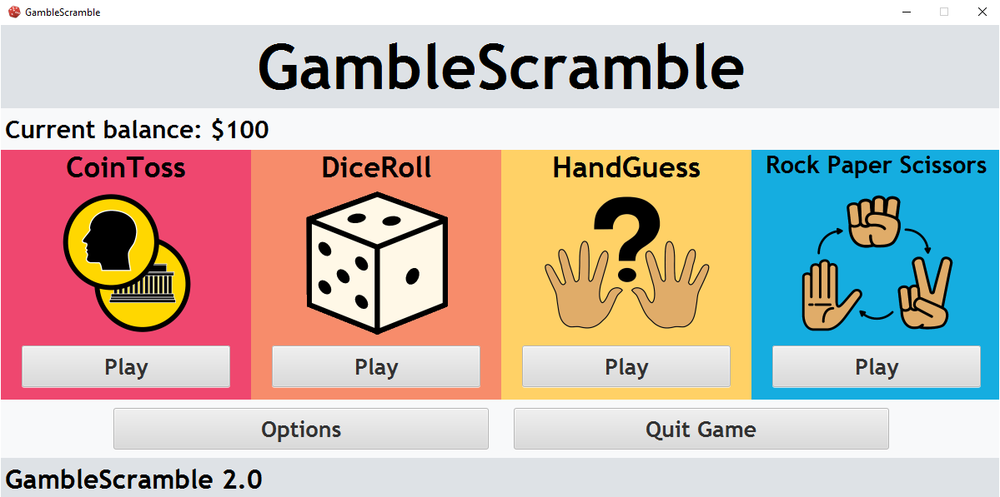

<!--Version-1.0.0-->

# GambleScramble

  
  

**A simple gambling game made with Java 17 and JavaFX 17.**

***

## GambleScramble Features:

When you start off the game the player starts with 100 dollars (USD) and can gamble their money with the following games:

1. CoinToss
2. DiceRoll 
3. HandGuess

These games are based on chance, with CoinToss having 1:2 odds of wining and a 2x payout; DiceRoll having 1:6 odds of winning and a 5x payout; HandGuess has a 1:11 odds and a 10x payout. More complex games will be added as this game gets updated.

The player can wish to convert their currency to the following currencies:

1. USD (default)
2. EUR
3. GBP
4. AUD
5. CAD
6. NZD

*Note: When converting currencies the conversion will round down the new balance to the current whole number.*

*Note: The exchange rates of the currencies are based on the time of the latest release.*

Currently there are only two themes: Light theme (default) and Dark theme, which can be changed in the options menu.

| Light theme | Dark theme |
| ------------- | ------------- |
|  |  |

***

## Requirements to edit source code:

1. Have [Java 17](https://jdk.java.net/) to run the source code.
2. Have the [JavaFX 17 SDK](https://gluonhq.com/products/javafx/) installed.
3. Have [SceneBuilder](https://gluonhq.com/products/scene-builder/) installed to easily edit .fxml files (optional, but highly recommended).

***

## Screenshots:

### Options page:
| Light theme | Dark theme |
| ------------- | ------------- |
|||

### CoinToss:
| Light theme | Dark theme |
| ------------- | ------------- |
|||

### DiceRoll:
| Light theme | Dark theme |
| ------------- | ------------- |
|||

### HandGuess:
| Light theme | Dark theme |
| ------------- | ------------- |
|||

### About box:
| Light theme | Dark theme |
| ------------- | ------------- |
|||
